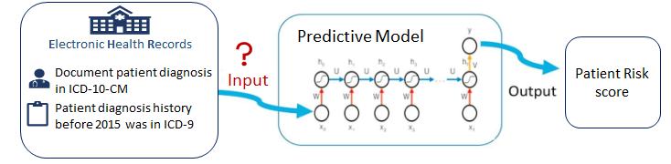
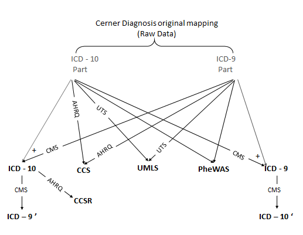
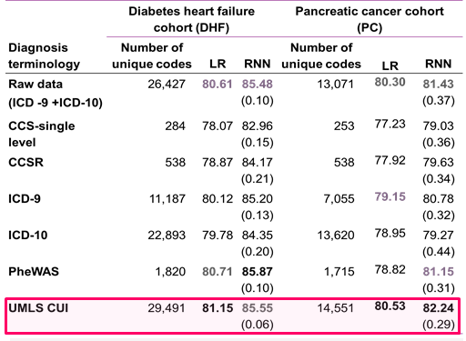

# Different Representation of EHR Diagnosis data: a comparison between UMLS and other terminologies 

The main purpose of this repository is to share the mapping tables between different Diagnosis terminologies used in our study [Representation of EHR data for predictive modeling: a comparison between UMLS and other terminologies](https://pubmed.ncbi.nlm.nih.gov/32930711/).

## Objective

To provide tools to systematicly investigate of how different diagnosis codes representations could affect the performance of predictive models, especially in the context of machine learning and deep learning.

 

## Methods
We compared feeding the predictive model using the raw diagnosis data as it is recorded in the system which was in our case a combination of ICD-9 and ICD-10 codes (the most common scenario) against normalizing the diagnosis codes to a single terminology representation. We projected the input diagnoses data in the Cerner HealthFacts database to Unified Medical Language System (UMLS) and 5 other terminologies, including CCS, CCSR, ICD-9, ICD-10, and PheWAS, for diagnosis codes normalization. We evaluated the prediction performances of these terminologies using logistic regression (LR) and  recurrent neural network (RNN) based predictive models and evalued the model performance on 2 different tasks: the risk prediction of heart failure in diabetic patients (DHF) and the risk prediction of pancreatic cancer (PC).  

  

## Results
For logistic regression, using UMLS delivered the optimal area under the receiver operating characteristics (AUROC) results in both heart failure prediction in diabetic patients (81.15%) and pancreatic cancer (80.53%) tasks. For recurrent neural network, UMLS worked best for pancreatic cancer prediction (AUROC 82.24%), second only (AUROC 85.55%) to PheWAS (AUROC 85.87%) for heart failure prediction in diabetic patients.

## Conclusion

In our experiments, terminologies with larger vocabularies and finer-grained representations were associated with better prediction performances. In particular, UMLS is consistently one of the best-performing ones. We believe that our work may help to inform better designs of predictive models, although further investigation is warranted.

## Dependencies

This Repo mainly utilized the code from our [Pytorch_EHR Repo](https://github.com/ZhiGroup/pytorch_ehr), therefore all required packages are the same used for that Repo including

  * Python 3.7+
  
  * Pytorch 1.4.0 +
  
  * Pandas 
  
  * Pickle
  
  * tqdm
  
  * sklearn

  * Matplotlib / Plotly (for visualizations)

## Contact

Please post a Github issue if you have any questions.

## Citation

Please acknowledge the following work in papers or derivative software:

Rasmy L, Tiryaki F, Zhou Y, Xiang Y, Tao C, Xu H, Zhi D. Representation of EHR data for predictive modeling: a comparison between UMLS and other terminologies. J Am Med Inform Assoc. 2020 Sep 15:ocaa180. doi: 10.1093/jamia/ocaa180. Epub ahead of print. PMID: 32930711.
